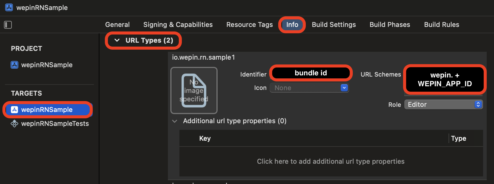

# wepin-react-native-sdk

Wepin React-Native SDK for Android OS and iOS

## ⏩ Get App ID and Key

Contact to wepin.contact@iotrust.kr

## ⏩ Install

### wepin react native sdk

```bash
npm install @wepin/react-native-sdk
```

or

```bash
yarn add @wepin/react-native-sdk
```

### peerDependencies

```bash
npm install react-native-device-info
npm install react-native-inappbrowser-reborn
npm install react-native-safe-area-context
npm install react-native-webview

# for ios
cd ios
pod install
```

or

```bash
yarn add react-native-device-info
yarn add react-native-inappbrowser-reborn
yarn add react-native-safe-area-context
yarn add react-native-webview

# for ios
cd ios 
pod install
```

## ⏩ Config Deep Link

Deep link scheme format: Your app package name or bundle id + '.wepin'

### For Android

Add the below line in your app's `AndroidMainfest.xml` file

```xml
<activity
	android:name=".MainActivity" 
	....
>
	....
        <intent-filter>
            <action android:name="android.intent.action.VIEW" />
            <category android:name="android.intent.category.DEFAULT" />
            <category android:name="android.intent.category.BROWSABLE" />
            <data android:scheme="PACKAGE_NAME.wepin" /> <!-- package name of your android app + '.wepin' -->
        </intent-filter>
      </activity>
```

### For iOS

Add the below line in your ios app's `AppDelegate.mm` file

```objectivec
#import <React/RCTLinkingManager.h>

...

// above @end
- (BOOL)application:(UIApplication *)application
  openURL:(nonnull NSURL *)url options:(nonnull NSDictionary<UIApplicationOpenURLOptionsKey,id> *)options
{
  return [RCTLinkingManager application:application openURL:url options: options];
}

```

Add the URL scheme as below:

1. Open your iOS project with the xcode
2. Click on Project Navigator
3. Select Target Project in Targets
4. Select Info Tab
5. Click the '+' buttons on URL Types
6. Enter Identifier and URL Schemes
   - Idenetifier: bundle id of your project
   - URL Schems: bundle id of your project + '.wepin'



## ⏩ Import SDK

```javascript
import Wepin from '@wepin/react-native-sdk
const wepin = Wepin.getInstance()
```

Add a  `<Wepin.WidgetView>` component within the main compenent and nest its content inside of it:

```typescript
function App(): JSX.Element {
    ....
  return (
    <Wepin.WidgetView>
        ...
    </Wepin.WidgetView>
  )
}
```

## ⏩ Initialize

Methods about initializing Wepin SDK

### init

```javascript
await wepin.init(appId, appSdkKey[, attributes])
```

#### Parameters

- `appId` \<string>
- `appKey` \<string>
- `attributes` \<IAttributes> _optional_
  - Type of `attributes` is assigned at [`@wepin/types`](https://github.com/WepinWallet/wepin-js-sdk-types) as `IAttributes`
    - type: The type of display of widget as wepin is initiated (defalut: 'hide)
      - 'hide' | 'show'
    - defaultLanguage: The language to be displayed on the widget (default: 'ko')
      - Currently, only 'ko' and 'en' are supported.
    - defaultCurrency: The currency to be displayed on the widget (default: 'KRW')

#### Example

```javascript
await wepin.init('APPID', 'APPKEY', {
  type: 'hide',
  defaultLanguage: 'en',
  defaultCurrency: 'USD',
})
```


### isInitialized

```javascript
wepin.isInitialized()
```

The `isInitialized()` method checks Wepin SDK is initialized.

#### Return value

- \<boolean>
  - `true` if Wepin SDK is already initialized.

## ⏩ Methods

Methods can be used after initialization of Wepin SDK.

### openWidget

```javascript
await wepin.openWidget()
```

The `openWidget()` method shows Wepin widget. If a user is not logged in, Wepin widget will show login page.

#### Return value

- `Promise` \<void>

### closeWidget

```javascript
await wepin.closeWidget()
```

The `closeWidget()` method closes Wepin widget.

#### Return value

- `Promise` \<void>

### getAccounts

```javascript
await wepin.getAccounts()
await wepin.getAccounts(networks)
```

The `getAccounts()` method returns user accounts. If user is not logged in, Wepin widget will be opened and show login page. It is recommended to use `getAccounts()` method without argument to get all user accounts.

#### Parameters

- `networks` \<Array> *optional*
  - `network` \<string> *optional*

#### Example

```javascript
const accounts = await wepin.getAccounts(['Ethereum'])
```

#### Return value

- `Promise` \<Array>
  - If user is logged in, it returns a `Promise` object resolved with array of `account` of networks.
    - Type of `account` is assigned at [`@wepin/types`](https://github.com/WepinWallet/wepin-js-sdk-types) as `IAccount`
    - `account` \<Object>
      - `address` \<string>
      - `network` \<string>
  - If networks aren't passed, it returns a `Promise` object resolved with array of `account` of all networks.
  - Example
    ```javascript
    [
        {
            address: "0x0000001111112222223333334444445555556666",
            network: "Ethereum"
        },
    ]
    ```
- `Promise` \<void>
  - If user is not logged in, it returns `Promise` \<void>.


### getStatus (Support from version `0.0.6-alpha`)

```javascript
wepin.getStatus()
```

The `getStatus()` method returns lifecycle of wepin.

#### Example

```javascript
var status = wepin.getStatus()
```

#### Return value

- \<WepinLifeCycle>
  - The `WepinLifeCycle` is defined at [`@wepin/types`](https://github.com/WepinWallet/wepin-js-sdk-types) as (Support from version `0.0.7`)
    - `not_initialized`: if wepin is not initialized
    - `initializing`: if wepin is initializing
    - `initialized`: if wepin is initialized
    - `before_login`: if wepin is initialized but the user is not logged in
    - `login`: if the user is logged in

### login(Support from version `0.0.6-alpha`)

```javascript
await wepin.login()
```

The `login()` method returns information of the logged-in user. If a user is not logged in, Wepin widget will show login page.

#### Example

```javascript
var userInfo = await wepin.login()
```

#### Return value

- `Promise` \<IWepinUser>

  - Type of `IWepinUser` is defined in [`@wepin/types`](https://github.com/WepinWallet/wepin-js-sdk-types) (Support from version `0.0.7`)

    - `status` \<'success'|'fail'>
    - `userInfo` \<object> _optional_
      - `userId` \<string>
      - `email` \<string>
      - `provider` \<'google'|'apple'>
  - Example

    ```js
    {
        status: 'success',
        userInfo: {
            userID: '123455',
            email: 'abc@test.com',
            provider: 'google'
            }
    }
    ```

### logout (Support from version `0.0.6-alpha`)

```javascript
await wepin.logout()
```

The `logout()` method performs a wepin logout .

#### Return value

- `Promise` \<void>

Example

```javascript
await wepin.logout()
```
