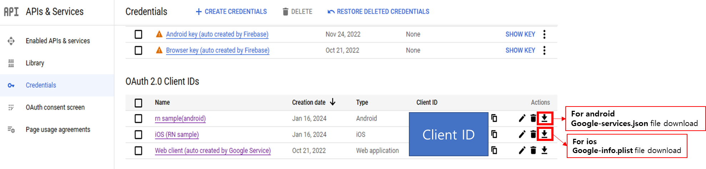
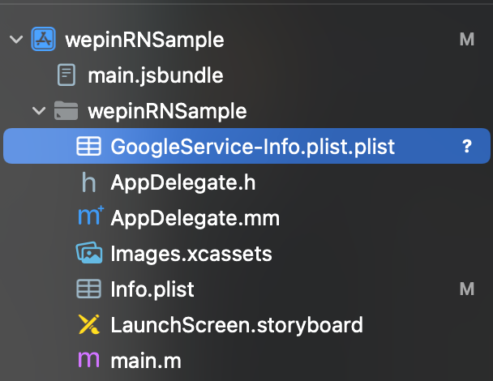
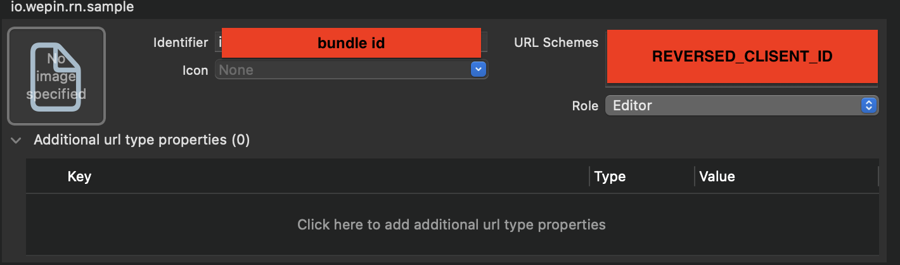

This is a new [**React Native**](https://reactnative.dev) project, bootstrapped using [`@react-native-community/cli`](https://github.com/react-native-community/cli).

# Getting Started

> **Note**: Make sure you have completed the [React Native - Environment Setup](https://reactnative.dev/docs/environment-setup) instructions till "Creating a new application" step, before proceeding.

## Step 1: Start the Metro Server

First, you will need to start **Metro**, the JavaScript _bundler_ that ships _with_ React Native.

To start Metro, run the following command from the _root_ of your React Native project:

```bash
# using npm
npm start

# OR using Yarn
yarn start
```

## Step 2: Start your Application

Let Metro Bundler run in its _own_ terminal. Open a _new_ terminal from the _root_ of your React Native project. Run the following command to start your _Android_ or _iOS_ app:

### For Android

```bash
# using npm
npm run android

# OR using Yarn
yarn android
```

### For iOS

```bash
# using npm
npm run ios

# OR using Yarn
yarn ios
```

If everything is set up _correctly_, you should see your new app running in your _Android Emulator_ or _iOS Simulator_ shortly provided you have set up your emulator/simulator correctly.

This is one way to run your app — you can also run it directly from within Android Studio and Xcode respectively.

## Step 3: Modifying your App

Now that you have successfully run the app, let's modify it.

1. Open `App.tsx` in your text editor of choice and edit some lines.
2. For **Android**: Press the `<kbd>`R `</kbd>` key twice or select **"Reload"** from the **Developer Menu** (`<kbd>`Ctrl `</kbd>` + `<kbd>`M `</kbd>` (on Window and Linux) or `<kbd>`Cmd ⌘`</kbd>` + `<kbd>`M `</kbd>` (on macOS)) to see your changes!

   For **iOS**: Hit `<kbd>`Cmd ⌘`</kbd>` + `<kbd>`R `</kbd>` in your iOS Simulator to reload the app and see your changes!

## (optional)Step 4: Setting .env (for idToken login)

Create a `.env` file in the root folder and set the following values:

```js
PRIVATE_KEY = 'PRIVATEKEY'
GOOGLE_WEB_CLIENT_ID = 'GOOGLE_WEBCLIENTID'
GOOGLE_IOS_CLIENT_ID = 'GOOGLE_IOSCLIENTID'
```

- Set the `PRIVATE_KEY` value to the private key issued along with the appId and appKey after registering the app on wepin.
- Set the values for `GOOGLE_WEB_CLIENT_ID` and `GOOGLE_IOS_CLIENT_ID` to the id values for the web platform and iOS platform for Google OAuth authentication. Retrieve these values from the OAuth 2.0 Client ID in the Google Cloud console ([OAuth Client ID creation link](https://support.google.com/cloud/answer/6158849#installedapplications&android&zippy=%2Cnative-applications%2Candroid) for reference).

  

- For iOS,

  - Download the `GoogleService-Info.plist` file and move it to the /ios directory path.
  - 
  - In the Info tab, click the + button under URL Types. Use the `Identifier` as the iOS bundle id used above, and set `URL Schemas` to the `REVERSED_CLIENT_ID` from the `GoogleService-Info.plist`.
  - 

To learn more about React Native, take a look at the following resources:

- [React Native Website](https://reactnative.dev) - learn more about React Native.
- [Getting Started](https://reactnative.dev/docs/environment-setup) - an **overview** of React Native and how setup your environment.
- [Learn the Basics](https://reactnative.dev/docs/getting-started) - a **guided tour** of the React Native **basics**.
- [Blog](https://reactnative.dev/blog) - read the latest official React Native **Blog** posts.
- [`@facebook/react-native`](https://github.com/facebook/react-native) - the Open Source; GitHub **repository** for React Native.
